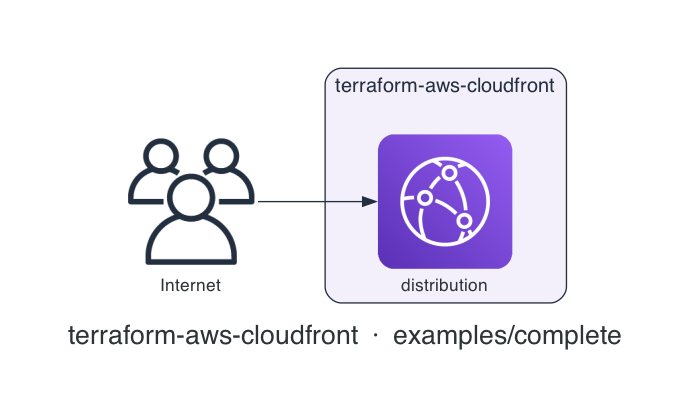

# terraform-aws-cloudfront

[](https://github.com/devotica-labs/terraform-aws-cloudfront/actions/workflows/ci.yml)
[](https://github.com/devotica-labs/terraform-aws-cloudfront/actions/workflows/release.yml)
[](LICENSE)

> Part of the **Devotica** Terraform catalog. Follows the cloudposse module standard (README.yaml-driven docs, the `enabled`/`namespace`/`environment`/`stage`/`name`/`attributes`/`tags`/`label_order` label surface, `examples/complete`, Makefile targets) implemented **natively** — no external naming or build-harness dependencies.

## Introduction

Terraform module for a single **Amazon CloudFront** distribution fronting one origin — either a **custom origin** (an ALB or API domain) or a private **S3 bucket** reached through an **Origin Access Control**. It is deliberately focused: one origin, one default cache behavior, fintech-safe TLS and firewall defaults.

Defaults are opinionated: viewers are **redirected to HTTPS**, the TLS floor is **`TLSv1.2_2021`** (once a real ACM certificate is attached), a **WAFv2 Web ACL** ARN passes straight through, S3 origins are served privately via OAC (`sigv4`), the price class is **`PriceClass_100`**, and teardown is clean (`retain_on_delete` off).

## Architecture

<!-- BEGIN_ARCH -->



<sub>Generated by `.github/workflows/architecture-diagram.yml` on every push to main. Do not edit the image by hand — change the Terraform code in `examples/complete/` and the bot will regenerate it.</sub>

<!-- END_ARCH -->

## Usage

```hcl
module "cloudfront" {
  source  = "devotica-labs/cloudfront/aws"
  version = "~> 0.1"

  namespace = "dvtca"
  stage     = "prod"
  name      = "web"           # distribution id → dvtca-prod-web

  # A public ALB as the origin; CloudFront talks to it over HTTPS.
  origin_type        = "custom"
  origin_domain_name = module.alb.dns_name

  # Attach the edge firewall built by terraform-aws-wafv2 (CLOUDFRONT scope).
  web_acl_id = module.waf.web_acl_arn

  tags = local.tags
}
```

A private S3 static site on a custom domain, fronted by an Origin Access Control:

```hcl
module "cloudfront" {
  source  = "devotica-labs/cloudfront/aws"
  version = "~> 0.1"

  namespace = "dvtca"
  stage     = "prod"
  name      = "assets"

  origin_type        = "s3"
  origin_domain_name = module.assets_bucket.bucket_regional_domain_name

  aliases             = ["cdn.example.com"]
  acm_certificate_arn = module.acm.certificate_arn   # us-east-1 for CloudFront

  # Reference module.cloudfront.oac_id in the bucket policy so only CloudFront reads it.
}
```

See [`examples/basic`](examples/basic) and [`examples/complete`](examples/complete).

## Defaults that matter

| Setting | Default | Why |
|---------|---------|-----|
| `viewer_protocol_policy` | `redirect-to-https` | Viewers are always upgraded to HTTPS. |
| `minimum_protocol_version` | `TLSv1.2_2021` | Modern TLS floor — applies once a real ACM certificate is attached (the CloudFront default certificate forces `TLSv1`). |
| `price_class` | `PriceClass_100` | North America + Europe edges; the cheapest tier that still covers primary markets. |
| OAC (`origin_type = "s3"`) | created, `sigv4` | S3 origins stay fully private — CloudFront signs every origin request; no public bucket policy. |
| `web_acl_id` | `null` (passthrough) | Attach a WAFv2 Web ACL (CLOUDFRONT scope) by ARN; no firewall is invented for you. |
| access logging | off unless `logging_bucket` set | Logging is optional and points at a bucket you control. |
| `retain_on_delete` | `false` | Destroy actually deletes the distribution, so teardown is clean. |

Aliases require a real ACM certificate — the module fails the plan if `aliases` are set without `acm_certificate_arn`, because the CloudFront default certificate only serves `*.cloudfront.net`.

## How this fits the Devotica catalog

`terraform-aws-alb` provides the custom origin this distribution fronts; `terraform-aws-s3` provides the private bucket origin (wire `oac_id` into its bucket policy). `terraform-aws-acm` issues the certificate for `aliases` (in us-east-1), `terraform-aws-wafv2` builds the Web ACL passed to `web_acl_id`, and `terraform-aws-route53` creates the alias record pointing at `domain_name` / `hosted_zone_id`.

## Makefile Targets

```
make fmt       # terraform fmt -recursive
make validate  # terraform init -backend=false && terraform validate
make test      # terraform test (unit + contract; integration needs AWS creds)
make readme    # regenerate the terraform-docs block below
```

<!-- BEGIN_TF_DOCS -->
<!-- terraform-docs regenerates this block via `make readme` / CI. Inputs and
     outputs are documented in variables.tf and outputs.tf. -->
<!-- END_TF_DOCS -->

## License

[Apache 2.0](LICENSE) © Devotica
